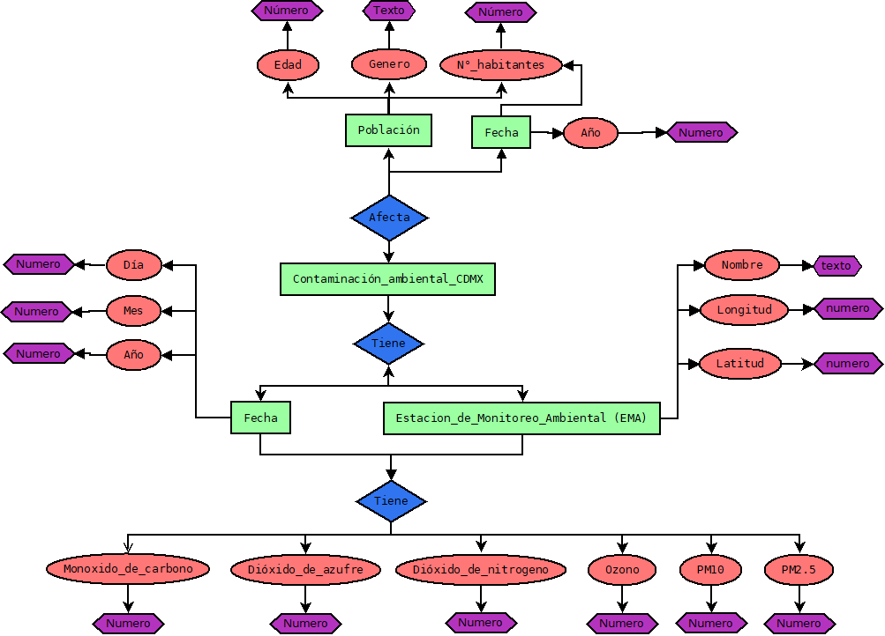

Tarea 2

[8 puntos] Convierte tu base de datos no estructurada en un modelo entidad-relación, representándolo con un diagrama entidad-relación. Usa nodos con figuras correctas y aristas claramente señaladas con los números correspondientes para las relaciones.

  

  

[2 punto] Muestra el dominio de los atributos.

| Variable     | Tipo de Variable | Descripcion Variable    | 
| :---        |    ----:   |          :--- |
| **artist**     | VARCHAR      | Nombre del artista  |
|**Song**   | VARCHAR        | Nombre de la cancion      |
| **Duracion**   | VARCHAR       | Duracion canción en milisegundos    |
| **Explicit**   | TINYTEXT      | Clasifica si la cancion o video musical contiene una o mas referencias a contenido que puede ser considerada ofensiva o no apropiada para niños    |
| **Year**   | VARCHAR       | Año en que fue lanzada la cancion      |
| **Popularity**   | VARCHAR        | Valor numero en el cual entre más alto sea, mayor es su popularidad.      |
| **Dancability**   | VARCHAR       | Describe que tan bailable es una cancion. Entre mayor sea su valor, más bailable. Algunos factores que afectan son el tempo, sensibilidad de ritmo, fuerza del beat, y regularidad. Entre 0 y 1.     |
| **Energy**   | VARCHAR       | Medida entre 0 y 1 que representa la percepcion de inetensidad y actididad de la cancion.     |
| **Key**   | VARCHAR     | Mapas para intepretar el pitch de una cacion. Los valores pueden tomar por ejemplo : E.g. 0 = C, 1 = C♯/D♭, 2 = D, and so on. y -1 si no se detecta ninguna llave musical.      |
| **Loudness**   | VARCHAR        | Nivel de ruido de la pista medida en decibeles. Este valor promedia el valor de decibeles en la pista completa.      |
| **Mode**   | VARCHAR        | Modalidad de la pista (Escala mayor o menor). Mayor = 1 y Menor = 0.      |
| **speechiness**   | VARCHAR        | Medida de la presencia de palabras en la cancion. Entre mayor sea el numero significa que es una pista que se basa mas en cantar o samples. Valores bajos indican que el alma de la cancion es más musical.      |
| **Acousticness**   | VARCHAR        | Medida de que tan acustica es una pista. Valor = 1 representra una cancion acustica.     |
| **Instrumentallness**   | VARCHAR        |  Prediccion si la cancion NO contiene o no vocales. "Ooh" "Aah" es considerada vocales. Rap es considerada vocal por lo que tendria un valor alto. Morat por ejemplo tendria un valor bajo.      |
| **Liveness**  | VARCHAR        |     Detecta la presencia de audiencia en la pista. ALtos numeros represntan que la pista proabblemente este grabada en vivo.     |
| **Valencia**   | VARCHAR        | Medidad de 0 a 1 que mide que tan positva es la cancion. Entre mayor sea el numero se asocia a sentimientos de felicidad y euforia. Una valor bajo representa una cancion triste,deprimida o enojada.       |
| **Tempo**   | VARCHAR        |     Tempo de la cancion en BPM (Beats per minute)
| **genre**   | TINYTEXT        |     Genero de la caciones. 

Acrualizacion, se a cargado corregido el diagrama y se an agregado el resto de los dominios.
